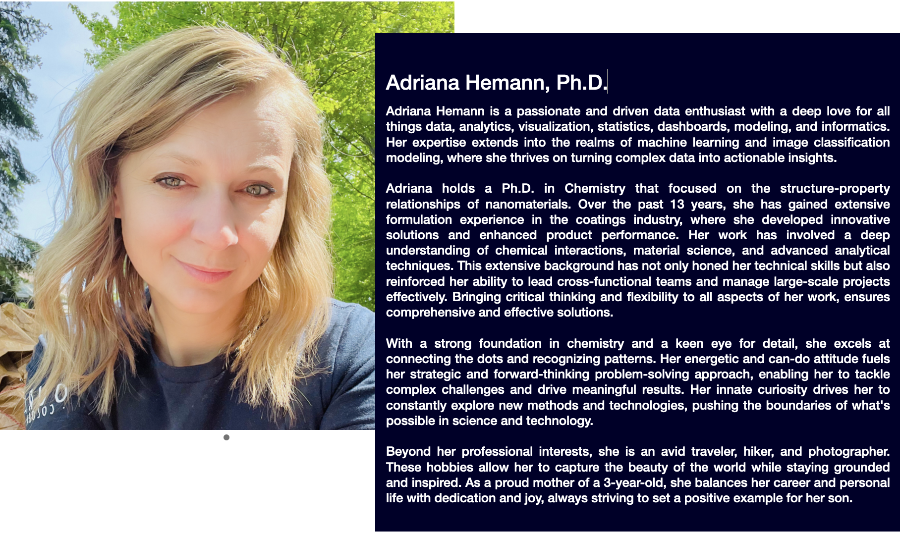

---
hide:
  - navigation
  - toc
---
# A bit about me

# My approach

When asked to describe my approach to solving problems in science and technology, I respond with four words: 

<h3 style="text-align: center;">VISIONARY THINKING. STRATEGIC TRANSFORMATION</h3> 

<!-- ### VISIONARY THINKING. STRATEGIC TRANSFORMATION -->

The first step is to create a clear vision of where you want to be. Begin by identifying the specific needs and desires of your employees and customers. Envision what success in the future would look like. If we could fully harness the potential of digital technologies, tools, and solutions, what new capabilities and efficiencies could we unlock? Consider how we can bridge the gap between the seamless digital experiences we enjoy in our personal lives and the ways our employees and customers interact with our systems. By aligning our digital strategies with these insights, we can create a more connected, efficient, and satisfying experience for everyone involved.
{: style="text-align: justify"}

<h3 style="text-align: center;">THAT IS VISIONARY THINKING</h3> 

<!-- ### THAT IS VISIONARY THINKING -->

The second step is to determine the path the organization can take to reach their envisioned future, step by step. This means narrowing the gap between the current reality and the ideal future state by developing a robust digital strategy and implementing a well-defined roadmap. By systematically addressing each step, organizations can not only enhance their bottom line but also significantly improve the employee and customer experience. Through thoughtful planning and execution, we can transform the employee and/or customer interactions, making them more efficient, engaging, and positive in a digital-first world.
{: style="text-align: justify"}

<h3 style="text-align: center;">THAT IS DEVELOPING THE STRATEGY NEEDED TO TRANSFORM</h3> 

<!-- ### THAT IS DEVELOPING THE STRATEGY NEEDED TO TRANSFORM -->
 

{: .center}
 

## [:material-account-multiple-check:{ .lg .middle } Would you like to work together? Check out Dataista services.](services.md)

 
 

