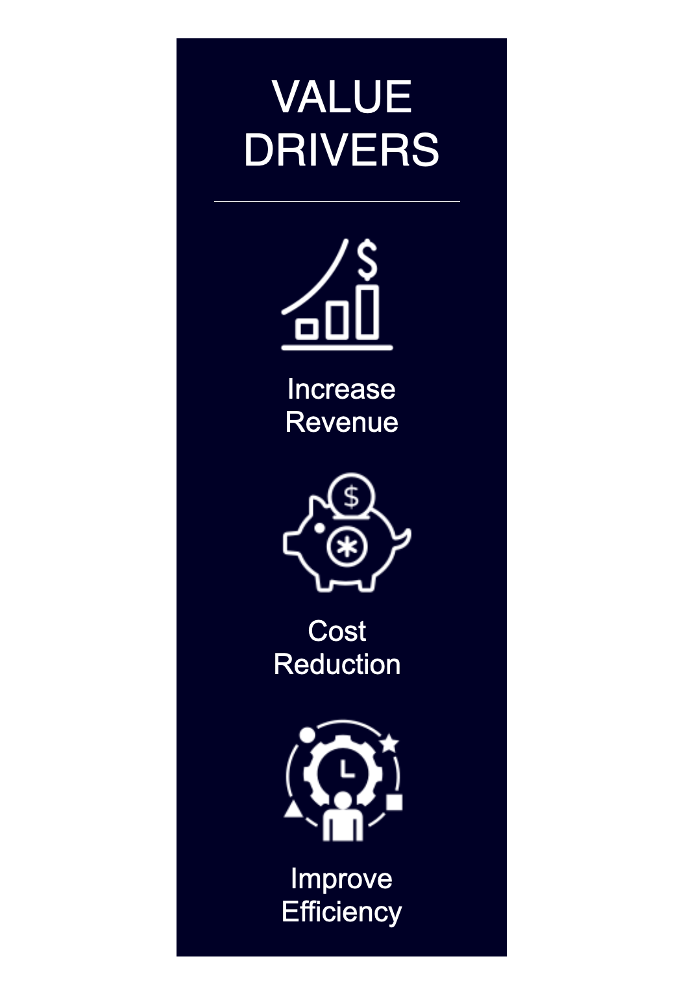
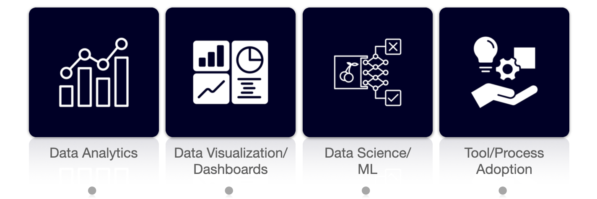

---
hide:
  - navigation
  - toc
---
<head>
    <meta charset="UTF-8">
    <meta name="viewport" content="width=device-width, initial-scale=1.0">
    <title>Landing Page</title>
    <link rel="stylesheet" href="stylesheets/extra.css">
</head>
<body>
    

        

        

            <h1>Your Data. Your Path.</h1>
            
Services that advance your digital transformation.

        

    

    
</body>
</html>
<!-- # Your data. Your path.   -->

Advance your digital transformation journey with our custom solutions for:

 

##### Optimize Your Data Workflow

Streamline your data processes and save resources by automating workflows, enabling faster access to data insights for more informed, data-driven decisions.
{: style="text-align: justify"}

##### Maximize Tool Utilization

Data tools and processes are only as valuable as their usage. Even the most advanced tools are ineffective if unused. Let us help you drive adoption to ensure you get the most out of your data tools and processes.
{: style="text-align: justify"}