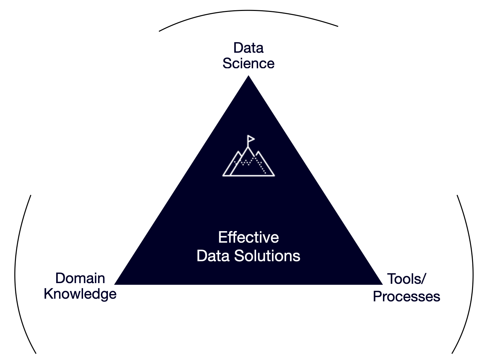

---
hide:
  - navigation
  - toc
---
{: .center}

 

 
 
 
 
 
Specializing in several technologies/platforms such as Python, R, Markdown, Tableau, and Microsoft, <strong> Dataista </strong>   can help you use your data to make better decisions and run your operations more effectively. Whether you rely on my expertise in chemistry, nanomaterials, structure-property relationships, and formulation, or bring your own domain knowledge, combining it with Dataista's advanced data science skills while considering your existing processes and tools, we will develop tailored solutions to meet your unique data needs.
{: style="text-align: justify"}

 

# Featured Services

<!-- {: .center} -->

-   :material-chart-timeline-variant-shimmer:{ .lg .middle } __data analytics__

    ---

    Unlock the full potential of your data with my comprehensive data analytics services. I can help you turn raw data into actionable insights, empowering you to make data-driven decisions that drive growth and efficiency. I offer:
    {: style="text-align: justify"}

    * Data connection and cleaning
    * Descriptive and inferential statistics
    * Trend analysis
    * Customized reporting

    [:octicons-arrow-right-24: Get started](contactus.md)

-   :material-chart-box-multiple-outline:{ .lg .middle } __data visualization__

    ---

    Transform complex data into visually compelling stories that are easy to understand and act upon. My data visualization services ensure that your data is presented in a clear, concise, and impactful manner. I offer:
    {: style="text-align: justify"}

    * Interactive dashboards
    * Infographics
    * Data storytelling
    * Custom visualization solutions
  
    [:octicons-arrow-right-24: Get started](contactus.md)

-   :material-monitor-dashboard:{ .lg .middle } __dashboards__

    ---

    Stay on top of your business metrics with our intuitive and dynamic dashboards. Designed to provide real-time insights, my dashboards help you monitor performance, identify trends, and make informed decisions quickly. My offerings include:
    {: style="text-align: justify"}

    * Executive dashboards
    * Operational dashboards
    * Performance monitoring
    * Custom KPI tracking
  
    [:octicons-arrow-right-24: Get started](contactus.md)

-   :material-sitemap-outline:{ .lg .middle } __data science__

    ---

    Leverage the power of data science to gain a competitive edge. My data science services encompass advanced analytical techniques and tools to uncover hidden patterns and insights. I specialize in:
    {: style="text-align: justify"}

    * Feature generation
    * Predictive analytics
    * Machine learning models
    * Big data analysis

    [:octicons-arrow-right-24: Get started](contactus.md)

-   :material-graph-outline:{ .lg .middle } __machine learning__

    ---

    Harness the power of machine learning to automate processes, predict outcomes, and drive innovation. My machine learning services are designed to help you build and deploy scalable ML models tailored to your business needs. Services include:
    {: style="text-align: justify"}

    * Model development and training
    * Algorithm selection and tuning
    * Model deployment and monitoring
    * AI-driven solutions

    [:octicons-arrow-right-24: Get started](contactus.md)

-   :material-chart-sankey:{ .lg .middle } __predictive and prescriptive modeling__

    ---

    Stay ahead of the curve with our predictive and prescriptive modeling services. I can help you use advanced algorithms to forecast future trends and prescribe optimal actions. My expertise includes:
    {: style="text-align: justify"}

    * Time series forecasting
    * Risk assessment models
    * Optimization models
    * Scenario analysis

    [:octicons-arrow-right-24: Get started](contactus.md)

-   :material-tooltip-check-outline:{ .lg .middle } __digital adoption__

    ---

    Accelerate your digital transformation journey with our digital adoption services. I can help you integrate new technologies seamlessly into your business operations, ensuring maximum efficiency and minimal disruption. My services cover:
    {: style="text-align: justify"}

    * Technology implementation
    * User training and support
    * Change management
    * Adoption analytics

    [:octicons-arrow-right-24: Get started](contactus.md)

-   :material-web-plus:{ .lg .middle } __website design or webapps__

    ---

    Enhance your online presence with a professional, user-friendly static website or interactive webapp. My design services ensure your documentation is informative, visually appealing, and easy to navigate. Need data interaction for employees/customers? My webapp services can help. I specialize in:
    {: style="text-align: justify"}

    * Intuitive navigation
    * Visually stunning designs
    * Enhanced data interaction

    [:octicons-arrow-right-24: Get started](contactus.md)

-   :material-magnify-expand:{ .lg .middle } __looking for something else?__

    ---

    Let’s talk! I am always looking to expand my portfolio and learn something new.
     
     
     
    
     
     
     

    [:octicons-arrow-right-24: Get started](contactus.md)

<!-- 
### Data Analytics
Unlock the full potential of your data with my comprehensive data analytics services.I can help you turn raw data into actionable insights, empowering you to make data-driven decisions that drive growth and efficiency. I offer:

* Data connection and cleaning
* Descriptive and inferential statistics
* Trend analysis
* Customized reporting

### Data Visualization
Transform complex data into visually compelling stories that are easy to understand and act upon. My data visualization services ensure that your data is presented in a clear, concise, and impactful manner. I offer:

* Interactive dashboards
* Infographics
* Data storytelling
* Custom visualization solutions
  
### Dashboards
Stay on top of your business metrics with our intuitive and dynamic dashboards. Designed to provide real-time insights, our dashboards help you monitor performance, identify trends, and make informed decisions quickly. Our offerings include:

* Executive dashboards
* Operational dashboards
* Performance monitoring
* Custom KPI tracking

### Data Science
Leverage the power of data science to gain a competitive edge. My data science services encompass advanced analytical techniques and tools to uncover hidden patterns and insights. I specialize in:

* Feature generation
* Predictive analytics
* Machine learning models
* Big data analysis

  
### Machine Learning
Harness the power of machine learning to automate processes, predict outcomes, and drive innovation. My machine learning services are designed to help you build and deploy scalable ML models tailored to your business needs. Services include:

* Model development and training
* Algorithm selection and tuning
* Model deployment and monitoring
* AI-driven solutions
  
### Predictive and Prescriptive Modeling
Stay ahead of the curve with our predictive and prescriptive modeling services. I can help you use advanced algorithms to forecast future trends and prescribe optimal actions. My expertise includes:

* Time series forecasting
* Risk assessment models
* Optimization models
* Scenario analysis
  
### Digital Adoption
Accelerate your digital transformation journey with our digital adoption services. I can help you integrate new technologies seamlessly into your business operations, ensuring maximum efficiency and minimal disruption. My services cover:

* Technology implementation
* User training and support
* Change management
* Adoption analytics -->
